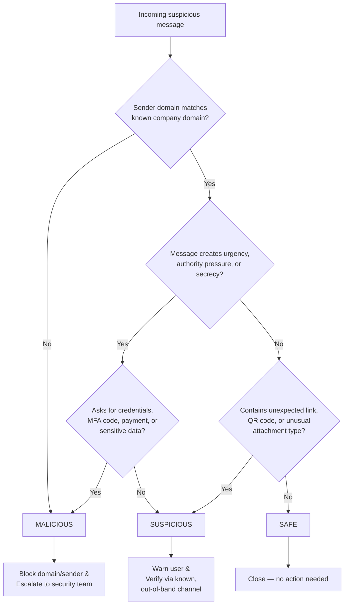

# Phishing Triage Decision Tree

## Visual (Mermaid)

## Text version (for non-rendering environments)

1. **Does the sender domain match the real, known company/brand domain exactly?**
   - No → **MALICIOUS** → Block domain & escalate.
   - Yes → go to 2.

2. **Does the message push urgency, authority, or secrecy** (e.g., "act now,"
   "confidential," "don't tell anyone," impersonating a boss or IT)?
   - Yes → go to 3.
   - No → go to 4.

3. **Does it directly ask for a password, MFA code, payment details, or other
   sensitive data?**
   - Yes → **MALICIOUS** → Block domain & escalate.
   - No → **SUSPICIOUS** → Warn user, verify through a known separate channel.

4. **Does it contain an unexpected link, QR code, or an unusual attachment
   type (.iso, .js, .scr, etc.)?**
   - Yes → **SUSPICIOUS** → Warn user, verify through a known separate channel.
   - No → **SAFE** → Close, no action needed.

## Outcomes
| Verdict | Action |
|---|---|
| 🟢 Safe | Close — no further action |
| 🟡 Suspicious | Warn the user; verify the request through a known, separate channel before acting |
| 🔴 Malicious | Block the domain/sender and escalate to the security team so it can be purged from other inboxes |
